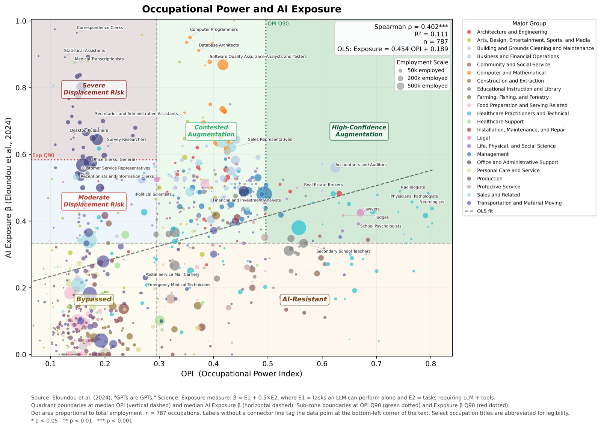

# Occupational Power Index (OPI)

**How much power does an occupation hold, and who gets left exposed when technology shifts?**

The Occupational Power Index scores **831 U.S. detailed occupations** (BLS OES, May 2024) on their power to respond, repurpose, and/or resist advancements in AI (and technology as a whole). There are two primary channels through which occupations respond to technology: they have a capacity to actively exercise collective political power to fight for a desired result, and simultaneously, they are passively protected from threats to their jurisdiction or wage level, according to the amount of autonomy their employees possess in the workplace. OPI quantifies these two channels into a score of occupational power, rendering it possible to compare across the labor market, to visualize threats posed to individual employment demographics, and most importantly, to combine with AI exposure measures for a unified per-occupation representation of response-adjusted exposure to AI.

## Method

OPI is the geometric mean of two sub-indices, so an occupation scores high only if it is strong on both:

$$\text{OPI} = \sqrt{\text{OAI} \times \text{OPPI}}$$

- **OAI (Occupational Autonomy Index):** esoteric knowledge, accountability, and task discretion.
- **OPPI (Occupational Political Power Index):** occupational licensing, industry lobbying, union coverage, and employment size.

**Robustness:** we re-ranked occupations under 173,050 alternative weighting scenarios. In 99.99% of them, the rankings kept a Spearman ρ of 0.90 or higher with the baseline.

## Findings

- **Power is concentrated in fields dominated by skilled, high-income, and non-minority employees.** Legal, healthcare practitioner, community and social service, and management occupations have the highest employment-weighted OPI. Farming, food preparation, cleaning and maintenance, and office support have the lowest.
- **The least powerful workers are often more exposed to AI.** The OPI index has a rank correlation of 0.402*** with AI exposure, indicating that the effects of technological advancement may be exacerbated by occupational power gaps. In the *Severe Displacement Risk* zone, 39 occupations employ about 8.0 million workers. Their mean OPI is 0.171, and 84.6% of those workers are women. The *High-Confidence Augmentation* zone has a mean OPI of 0.602.

OPI vs. AI exposure β (Eloundou et al., 2024), n = 787 occupations. Dot size is proportional to employment.

## Team

- **Kameron Rabizadeh**, Northwestern University
- **Hatim Rahman**, Kellogg School of Management, Northwestern University

> 🚧 **Code release coming soon.** The full replication pipeline, scored datasets, and interactive dashboard will be published here.
